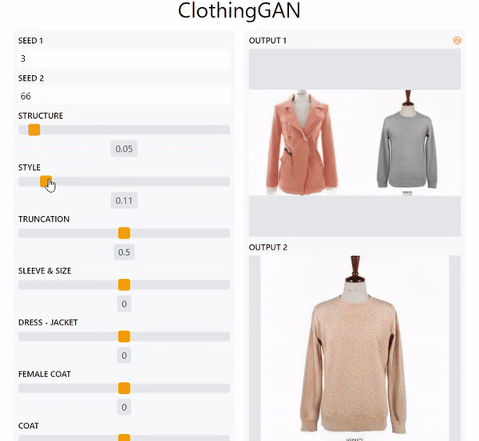

# Guccio AI: GAN Powered Clothing Design Generator
[](https://colab.research.google.com/github/AdiNarendra98/AI-for-Fashion/blob/main/Guccio%20AI(Clothing%20Design%20Generator)/ClothingGAN_Demo.ipynb)
[](https://huggingface.co/spaces/Dinoking/Guccio-AI-Designer)





## Inspiration
GAN or Generative Adversarial Network is a generative model that able to generate images by learning the probability distribution of a large image dataset. I always find GANs fascinating as it enables me to generate high-quality arts or design even without the technical or artistic skill in drawing. Recently, I've seen many face editing demonstrations on GAN, but never seen semantic manipulation in other datasets. Hence,  I created ClothingGAN an application where you can collaboratively design clothes without high technical expertise.

## What it does
GuccioAI able to generate clothing images and mix these images. While mixing, you can control which structure or style that you want the clothing to copy. Additionally, you can edit the generated clothing with several given attributes such as dark color, jacket, dress, or coat.

## How I built it
I trained StyleGAN2-ADA on a subset of the Lookbook dataset. The total images I trained it on are 8,726 clothing images with a clean background. I transfer learned from FFHQ model and trained the model for a day.

After finished training the GAN, I proceeded to use GANSpace method to find important directions in the latent space. Then, I tried to guess what these directions represent and labeled them accordingly. The reason I use GANSpace is that it is unsupervised and does not need an attribute classifier.

Finally, I created a UI with Gradio UI library. All the development is done on Colab. Gradio made deployment very easy. I can directly deploy the UI from Colab where Gradio will create a proxy from the Colab server to their domain and the given URL, hence allowing the general public to use the UI or demo. However, since I cannot keep the Colab server on continuously due to GPU usage, ping me if you want to try out the demo.


## Challenges I ran into
One of the challenges I faced was fixing a memory leak issue. Part of the code keeps crashing, and I initially thought I cannot fit the model to the GPU memory, however, after hours of debugging, I finally found the code that has the memory leak.

## What I learned
I am a beginner but comfortable with GAN but I have always been intimidated on deploying ML models. Luckily, I discovered Gradio UI, a library that makes ML deployment very easy. There were also other alternatives such as StreamLit or Dash, but found Gradio as the easiest to work with. One shortcoming is that it's quite inflexible in terms of customization.

## What's next for GuccioAI
There is a lot of potential for the project. Some features that can be added are appearance transfer, image inversion (uploading & editing real image), generating the fashion model itself, conditional text input with OpenAI CLIP model, etc.

## Acknowledgements
I would like to thank:

* The authors of the PyTorch implementations of [BigGAN][biggan_pytorch], [StyleGAN][stylegan_pytorch], and [StyleGAN2][stylegan2_pytorch]:<br>Thomas Wolf, Piotr Bialecki, Thomas Viehmann, and Kim Seonghyeon.
* Joel Simon from ArtBreeder for providing us with the landscape model for StyleGAN.<br>(unfortunately we cannot distribute this model)
* David Bau and colleagues for the excellent [GAN Dissection][gandissect] project.
* Justin Pinkney for the [Awesome Pretrained StyleGAN][pretrained_stylegan] collection.
* Tuomas Kynkäänniemi for giving us a helping hand with the experiments.
* The Aalto Science-IT project for providing computational resources for this project.
* [Erik Härkönen](https://github.com/harskish/ganspace) and Muhammad Fathy Rashad for the inspiration for the project


## Citation
```
@inproceedings{härkönen2020ganspace,
  title     = {GANSpace: Discovering Interpretable GAN Controls},
  author    = {Erik Härkönen and Aaron Hertzmann and Jaakko Lehtinen and Sylvain Paris},
  booktitle = {Proc. NeurIPS},
  year      = {2020}
}
```
[biggan_pytorch]: https://github.com/huggingface/pytorch-pretrained-BigGAN
[stylegan_pytorch]: https://github.com/lernapparat/lernapparat/blob/master/style_gan/pytorch_style_gan.ipynb
[stylegan2_pytorch]: https://github.com/rosinality/stylegan2-pytorch
[gandissect]: https://github.com/CSAILVision/GANDissect
[pretrained_stylegan]: https://github.com/justinpinkney/awesome-pretrained-stylegan


